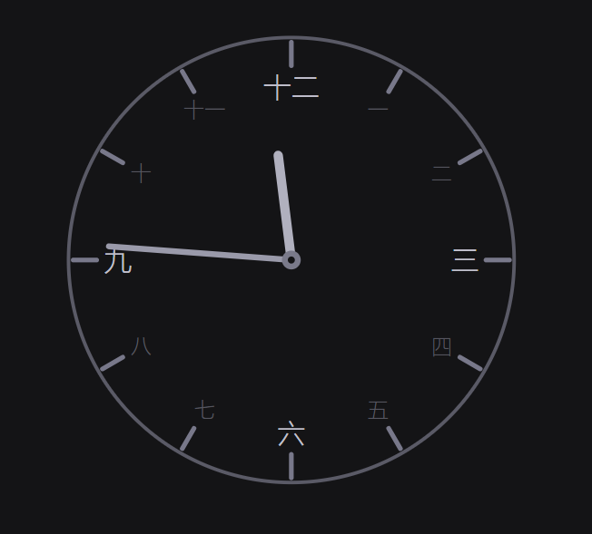

# アナログ時計 — Analog Clock

A minimal, dark-themed analog clock with Japanese kanji numerals. Keep it on screen while you work. Just double-click `analog-clock-jp.html` — no install, no build, no server.



 

## Features

- **Dark theme** — easy on the eyes, blends into any desktop
- **Gray color palette** — neutral, non-distracting tones
- **Japanese kanji numerals** — 一, 二, 三 ... 十二 on the clock face
- **Hour & minute hands only** — no second hand for a calm display
- **Transparent face** — clock edge and ticks float on the dark background
- **12 hour tick marks** — clean, no minute markers
- **Cardinal hours prominent** — 十二, 三, 六, 九 are brighter, others subtle
- **Smooth motion** — hands update every frame via `requestAnimationFrame`
- **Zero dependencies** — single HTML file, pure HTML/CSS/JS + SVG
- **Japanese tab title** — browser tab shows アナログ時計
- **Google Fonts** — uses [Outfit](https://fonts.google.com/specimen/Outfit) (falls back to sans-serif offline)

## Usage

```
double-click index.html
```

That's it. Opens in your default browser.

## File Structure

```
analog-clock/
├── index.html    ← the clock (open this)
├── README.md     ← this file
└── agent.md      ← AI agent instructions
```

## Customization

All colors are defined as CSS custom properties in `:root` inside `index.html`:

| Variable       | Default   | Purpose              |
|----------------|-----------|----------------------|
| `--bg`         | `#141416` | Page background      |
| `--copper`     | `#b0b0be` | Hour hand color      |
| `--copper-dim` | `#5a5a66` | Clock edge ring      |
| `--rust-2`     | `#9a9aaa` | Minute hand color    |
| `--tick-major` | `#78788a` | Hour tick marks      |
| `--text`       | `#c0c0cc` | Cardinal hour numbers|
| `--text-dim`   | `#55555f` | Other hour numbers   |

### Resize

Change the `.clock-wrapper` width/height in CSS (default `320px × 320px`).

## License

Free to use and modify.
